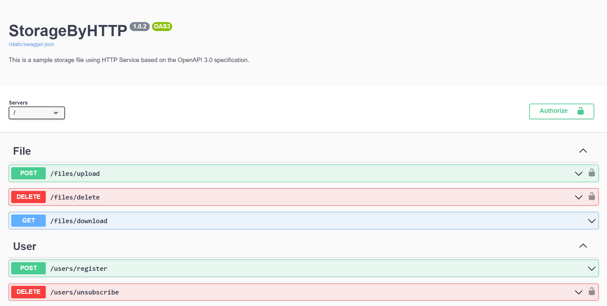

# StorageByHTTP

## Описание проекта
Storage By HTTP - это хранилище файлов для пользователей. Доступ к файлам предоставляется по хэш значению.

## Технологический стек
- **Язык программирования:** Python
- **Фреймворки:** Flask
- **Базы данных:** SQLite with SQLAlchemy 
- **Другие инструменты:** Swagger

## Установка
1. Клонируйте репозиторий: `git clone https://github.com/artm44/StorageByHTTP.git`
2. Создайте виртуальное окружение: `python -m venv venv`
3. Активируйте виртуальное окружение:
- На Windows: `venv\Scripts\activate`
- На Linux/Mac: `source venv/bin/activate`
4. Установите зависимости: `pip install -r requirements.txt`
5. Создайте базу данных:
  ```
  from app import app, db
  with app.app_context():
    db.create_all()
  ```
6. Запустите приложение: `python app.py`

## Функциональности
1. **Регистрация пользователей** 
2. **Загрузка, удаление и скачивание файлов**

## Скриншоты

*SwaggerUI*

## Лицензия
Этот проект лицензирован в соответствии с условиями [MIT License](LICENSE).

